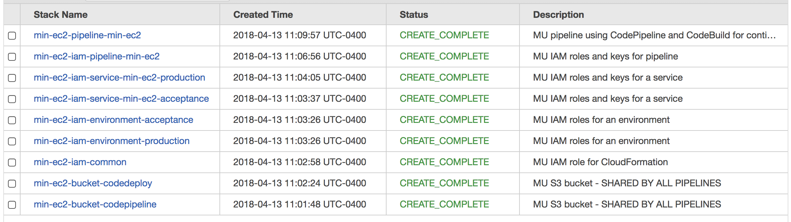
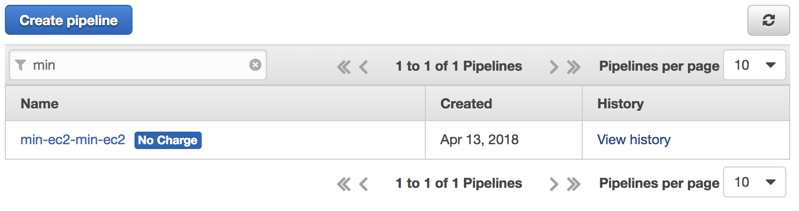
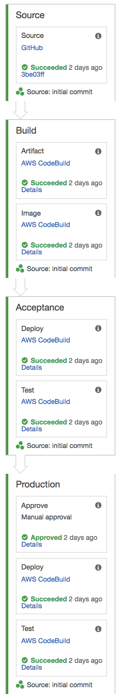
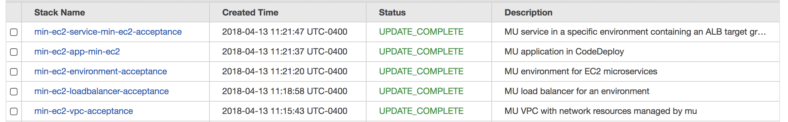
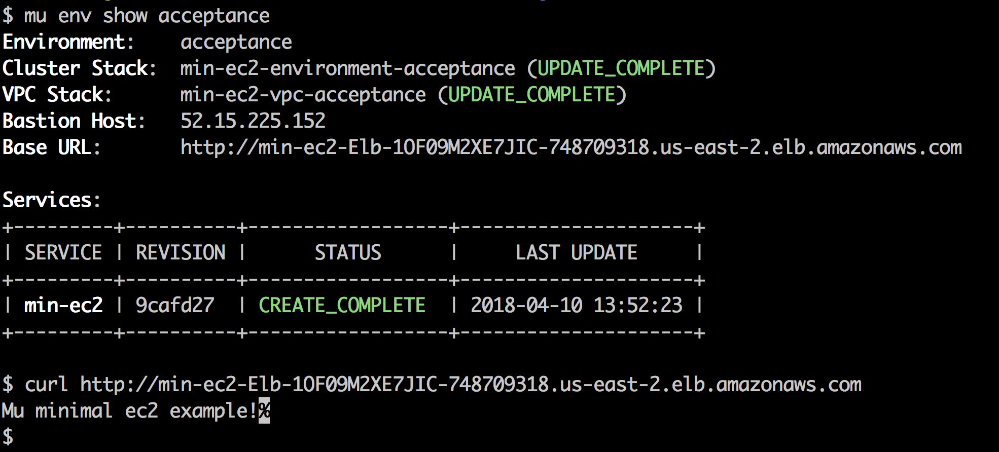

<br/>

# Continuous Delivery for Microservices on EC2 with `mu`


Learn how to deploy a webapp to AWS EC2 using mu. If you want to get into microservices, but aren't ready to take the container plunge, you can deploy mu projects directly to AWS EC2 instances.  Using mu's EC2 mode, you can leverage the benefits of microservices without containerization,  and speed up development feedback loops.

The web app in this article is the smallest possible Flask application. You can adapt this example to deploy other applications that include their own web servers, like Django, NodeJS with Express, Ruby with puma/thin/passenger, Jetty or even Spring Boot.

[Stelligent mu](http://getmu.io) is a great open source tool to deploy Microservices to t]he AWS cloud. It has three modes of deployment:

	* AWS ECS - (Elastic Container Service, which runs Docker containers on EC2).</li>
	* AWS Fargate - (A simpler “serverless” version of ECS)</li>
	* AWS EC2 instances without Docker containers.  This is the mode we're covering in this article.</li>

In this blog post, we're going to:
	* Fork this example repository on Github.com</li>
	* Change the mu.yml to point to your fork</li>
	* Create the mu pipeline</li>
	* Walk through the resources <code>mu</code> creates for you, and</li>
	* Explain the role each file plays in deploying the app.</li>


# Technologies used

  * Stelligent [`mu`](https://github.com/stelligent/mu) 
  * Amazon Web Services
    * AWS Cloudformation
    * AWS CodePipeline
    * AWS CodeBuild
    * AWS CodeDeploy
    * AWS Elastic LoadBalancers, VPC, Subnets
  * [Upstart](http://upstart.ubuntu.com/cookbook/#standard-environment-variables), which manages services on Amazon Linux & other CentOS 6.x-based systems.

# Prerequisites
  * An AWS Account
  * a Github Account
  * a Github Token - [create one here](https://github.com/settings/tokens)
  * Stelligent [`mu`](https://github.com/stelligent/mu) 
  * AWS Access keys set up in $HOME/.aws 

# Instructions

## Make your own repository
  * Fork [this repository](https://github.com/stelligent/mu-minimal-ec2) in github.
  * Clone your forked repository to your workstation:  

    `git clone git@github.com:<your-github-name>/mu-minimal-ec2.git`

  * Go to the newly cloned directory
    `cd mu-minimal-ec2`
  * Edit the `repo:` line 17 of `mu.yml`, to match your new repository's URL.
  * Commit and push your changes
    ```bash
    git commit -a -m "modify the repo: attribute in mu.yml" 
    git push 
    ```
  * Create the mu pipeline
    `mu pipeline up -t <your-github-token>`

## Walkthrough of the mu pipeline

The `mu pipeline up` command creates the CloudFormation stacks for the CodePipeline, CodeBuild and CodeDeploy services.  
    
Navigate to the CloudFormation console, and watch the pipeline stacks form.  They'll look something like this:

 <a style='margin-left: 4em;' href="./blog-images/min-pipeline-stacks.png">
 </img>
 </a>

Once the pipeline stacks are created, open the CodePipeline console. You should have one pipeline listed. Click on it.

 <a style='margin-left: 4em;' href="./blog-images/pipeline-list.png">
 </img>
 </a>

The mu pipeline looks like this:

  * Source – the CodeBuild service retrieves a copy of your source code from GitHub or AWS CodeCommit. 
  * Build - your software is built, tested, packaged according to instructions in your repo's buildspec.yml file. This uses AWS CodeBuild.
  * Deploy to Acceptance - a new environment called "acceptance" is created (or updated) with your software.  This uses AWS CodeDeploy.
  * Deploy to Production - after the one-and-only manual step, which is to offer Red and Green buttons to stop the pipeline, or deploy the software that is in Acceptance to the last environment, which is Production. This also uses AWS CodeDeploy. 

 <a style='margin-left: 4em;' href="./blog-images/pipeline-detail.png">
 </img>
 </a>

Once the pipeline stacks are complete, you can watch the CodePipeline execute. The CodePipeline/CodeDeploy/CodeBuild services start building your software within a few moments.

When your pipeline reaches the Deploy stage, the **CodeDeploy service creates Infrastructure stacks for each Environment**, and will update them with each subsequent build.  This is another core concept in DevOps known as [infrastructure-as-code](https://stelligent.com/2017/06/29/devops-benefits-of-infrastructure-as-code/), and is fully implemented by `mu pipeline`.   

The additional environment stacks look like this:

 <a style='margin-left: 4em;' href="./blog-images/min-env-stacks.png">
 </img>
 </a>

The infrastructure created by these additional stacks include:
  * networking: VPC, subnets, security groups
  * compute: EC2 instances (alternatively, ECS and Fargate are also supported in [`mu`](https://github.com/stelligent/mu))
  * storage: S3 buckets supporting the build artifacts
  * resiliency: AutoScaling groups and the Elastic Load Balancer definitions come with [`mu`](https://github.com/stelligent/mu) by default. 

This means that if you want to change your infrastructure (AutoScaling parameters, your EC2 or RDS instance sizes, etc), you can implement those changes the same way you do your code changes:  Change a file, run `git add`, `git commit`, and `git push`!  

# Walkthrough of the files 

## `mu.yml`

```yaml {.line-numbers}
 1    namespace: min-ec2
 2    environments:
 3    - name: acceptance
 4      provider: ec2
 5    - name: production
 6     provider: ec2
 7
 8    service:
 9     name: min-ec2
10    port: 8080
11     healthEndpoint: /
12     pathPatterns:
13     - /*
14     pipeline:
15       source:
16         provider: GitHub
17         repo: stelligent/mu-minimal-ec2
```


Naturally, this example of [`mu`](https://github.com/stelligent/mu) usage starts with a [`mu.yml`](https://github.com/stelligent/mu-minimal-ec2/blob/master/mu.yml).
There are two sections: one for `environments`, and one for `service`s.

The `environments:` section from lines 2 to 6 (above), are a simple list of the environment `name`s you wish to have (acceptance, staging, sandbox, demo, production, whatever).  The `provider` value can have one of three different values (`ec2`, `ecs`, and `fargate`).  

To learn more about other configuring `mu` environments, refer to the [wiki page for Mu Environments](https://github.com/stelligent/mu/wiki/Environments).

The `services:` section is from lines 8 to 17 (above), and specifies just the bare necessities.  We're going to accept incoming connections on port 80, route them to our application on port 8080, checking the / endpoint for `200 OK` responses, and use the code in the `repo` specified on line 17.

To learn more about configuring `mu` services, refer to the [wiki page for Mu Services](https://github.com/stelligent/mu/wiki/Services)

## `buildspec.yml`

```yaml
 1 version: 0.2
 2 
 3 phases:
 4   build:
 5     commands:
 6       - pip install Flask
 7 
 8 artifacts:
 9   files:
10    - "**/*"
```

[`mu`](https://github.com/stelligent/mu)  uses AWS CodePipeline, CodeBuild, and CodeDeploy to turn your github repo into a deployed service.  The [buildspec.yml](https://github.com/stelligent/mu-minimal-ec2/blob/master/buildspec.yml) contains instructions (lines 3-6), on how to install prerequisites, how to invoke the build, do any postprocessing (minification, compression, archiving, etc).  

Finally, you specify what files are to be deployed via the `artifacts/files:` section from line 8 to 10.

You can (and should) also use buildspec.yml to run unit tests.  Make sure all your commands return non-zero if there are any failures.

## `hello.py`

```python
 1  from flask import Flask
 2  app = Flask(__name__)
 3 
 4  @app.route("/")
 5  def hello():
 6     return "Mu minimal ec2 example, v2!\n" 
```

In this example repo, we have included the smallest possible [Flask](http://flask.pocoo.org/) application possible, predictably named [hello.py](https://github.com/stelligent/mu-minimal-ec2/blob/master/hello.py).  It listens on a port number, and responds to incoming `GET /` requests with a hardcoded string.

So, now we just needs to tell the system how to install it, start it, and stop this service.

## appspec.yml 

```yaml
 1    version: 0.0
 2    os: linux
 3    files:
 4     - source: ./hello.py
 5       destination: /home/ec2-home/hello/
 6     - source: ./etc/init/mu-minimal-ec2.conf 
 7       destination: /etc/init/
 8 
 9    hooks:
10     BeforeInstall:
11       - location: codedeploy/remove_previous_install.sh
12         timeout: 30
13     ApplicationStop:
14       - location: codedeploy/stop_server.sh
15         timeout: 30
16     ApplicationStart:
17       - location: codedeploy/start_server.sh
18         timeout: 30
```

The [`appspec.yml`](https://github.com/stelligent/mu-minimal-ec2/blob/master/appspec.yml)  file contains the commands that install, start and stop the service.  
 * The `files` section tells the system  which files to move, and where they should reside.
 * There are `hooks` section, with hooks called `BeforeInstall` (line 8), `ApplicationStop` (line 11), and `ApplicationStart` (line 14).  Each hook has a script location and a timeout in seconds.  These scripts reside in a `codedeploy` directory, primarily to keep the root directory a little cleaner.

## `./codedeploy` directory

 * `codedeploy/remove_previous_install.sh` removes /home/ec2-user/hello/hello.py and /etc/init/mu-minimal-ec2.conf. 

```bash
    1	#!/bin/bash -xe
    2	/bin/rm -rf /home/ec2-home/hello* /etc/init/mu-minimal-ec2.conf
    3	exit 0
```

 * `codedeploy/start_server.sh` tells upstart to start the service.
```bash
    1	#!/bin/bash -x
    2	set +e
    3	stop mu-minimal-ec2
    4	start mu-minimal-ec2
    5	exit 0
```
 * `codedeploy/stop_server.sh` tells `upstart` to stop the service. 
```bash
    1	#!/bin/bash -xe
    2	stop mu-minimal-ec2
    3	exit 0
```

# Use your new application

Use `mu env show acceptance` to display key information about your app.  One of the attributes is the ELB endpoint.  

 <a style='margin-left: 4em;' href="./blog-images/min-mu-env.png">
 </img>
 </a>

# Conclusion
This repository demonstrates using [`mu`](https://github.com/stelligent/mu) to deploy software to EC2.  You should also know that this is just one of several deployment models that [`mu`](https://github.com/stelligent/mu)  supports.  [`mu`](https://github.com/stelligent/mu) can also dockerize your application and deploy it to [AWS Elastic Container Service (Amazon ECS)](https://aws.amazon.com/ecs/) and [AWS Fargate](https://aws.amazon.com/fargate/). For the latest developments in [`mu`](https://github.com/stelligent/mu), you can watch the mu repository.

Stelligent engineers also staff a live chat/support forum at [gitter.im/stelligent/mu](https://gitter.im/stelligent/mu).  You can also read through the [mu wiki](https://github.com/stelligent/mu/wiki) or file an [issue](https://github.com/stelligent/mu/issues).
